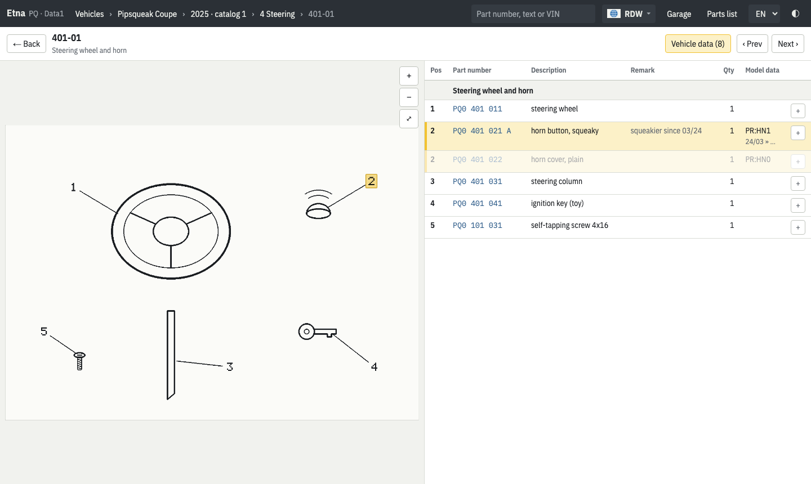
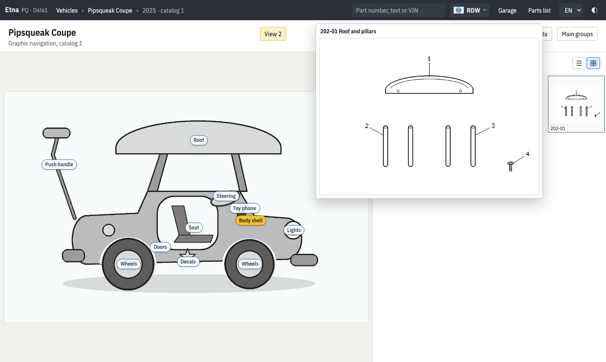
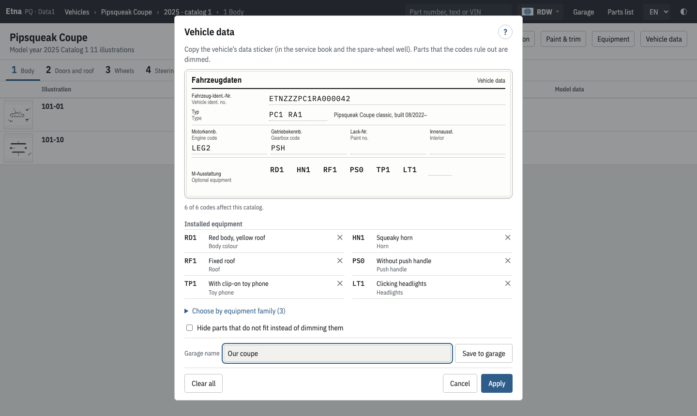
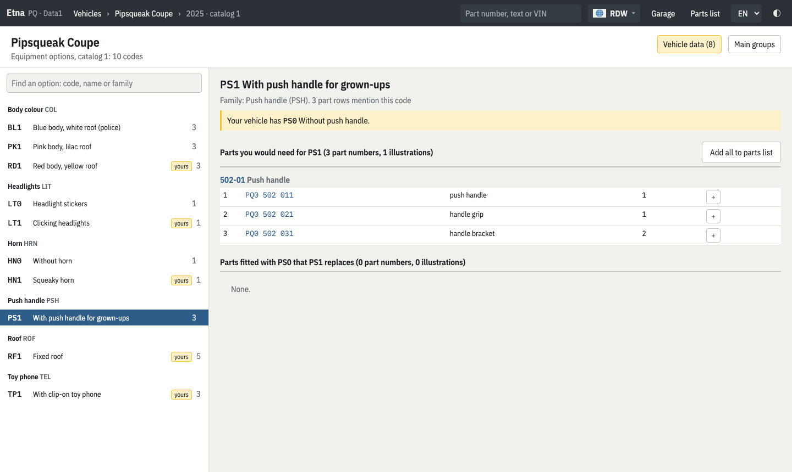

# Etna

_Exploded views, erupting parts._

Etna opens a dealer parts-catalog dump in your browser and lets you browse it the way the dealer
software does. **[Open Etna](https://complex256.github.io/etna/)** and choose your dump folder, or
press **Try the demo** to explore the built-in catalog of a ride-on toy car.

<picture>
  <source media="(prefers-color-scheme: dark)" srcset="docs/screenshots/illustration-dark.png">
  
</picture>

## Features

- **Private and offline.** The dump is read in the browser tab and never uploaded. The whole app is
  one HTML file you can keep and open from disk.
- **Illustrations with hotspots.** Pan and zoom exploded views; click a number to find its part,
  or a part to find it in the drawing. Previous/next with the arrow keys.
- **Graphic navigation.** Pick an area on a picture of the vehicle and see its illustrations as a
  list or a gallery, with instant, sharp previews on hover.
- **Vehicle data.** Enter the data sticker (type, engine, gearbox, equipment codes) and parts and
  illustrations that do not fit your vehicle are dimmed or hidden. Decode a VIN to its catalog.
- **Retrofit planner.** For any option, see the parts you would need, the parts it replaces, and
  what else it depends on.
- **Garage.** Save vehicles once and reopen them with their catalog and codes; export a backup.
- **Part details.** Price, supersessions, where else a part is used, service notes and pictures.
- **Search.** Part numbers, descriptions across all catalogs, engine and gearbox codes, VINs.
- **Parts list.** Collect parts with quantities and prices; export CSV, copy or print.
- **Paint and trim**, engine and gearbox code registers, every language the dump carries, and a
  dark mode.

## Screenshots

<table>
  <tr>
    <td width="50%"><picture>
  <source media="(prefers-color-scheme: dark)" srcset="docs/screenshots/graphic-navigation-dark.png">
  
</picture><br><sub>Graphic navigation: an area's illustrations as a gallery, with a hover preview.</sub></td>
    <td width="50%"><picture>
  <source media="(prefers-color-scheme: dark)" srcset="docs/screenshots/vehicle-data-dark.png">
  
</picture><br><sub>Vehicle data, entered like the car's data sticker, and saved to the garage.</sub></td>
  </tr>
  <tr>
    <td colspan="2"><picture>
  <source media="(prefers-color-scheme: dark)" srcset="docs/screenshots/equipment-dark.png">
  
</picture><br><sub>Retrofit planner: the parts an option needs on your vehicle.</sub></td>
  </tr>
</table>

The screenshots show the built-in demo and follow your GitHub light or dark theme. Regenerate them
with `make screenshots`.

## Hosting

Published to **https://complex256.github.io/etna/** from `main` by `.github/workflows/pages.yml`,
which also runs the checks and tests. You can download the page and open it from disk too.

## Setup

The toolchain is [Vite+](https://viteplus.dev) (`vp`): it manages the Node version (`.node-version`)
and pnpm, and runs the dev server, build, tests, lint (Oxlint) and format (Oxfmt).

```sh
curl -fsSL https://vite.plus | bash     # once; then open a new shell
make install
```

## Everyday use

| Command            | What it does                                                                 |
| ------------------ | ---------------------------------------------------------------------------- |
| `make dev`         | Dev server with hot reload that opens `DUMP` directly                        |
| `make build`       | Type-check and build `dist/index.html`                                       |
| `make serve`       | Build and serve it on localhost (the folder picker needs localhost or HTTPS) |
| `make test`        | Format, lint and type checks, then unit tests (the dump tests use `DUMP`)    |
| `make e2e`         | Browser tests (Playwright): the demo catalog, plus `DUMP` when set           |
| `make screenshots` | Retake the README screenshots from the demo, light and dark                  |

`DUMP` is a brand folder, the one containing `Data1`/`Data2`, `Bilder` and `minis`:
`make dev DUMP=/path/to/dump/<brand>` (or export `DUMP` once in your shell).

## Layout

- `src/lib/` — the data layer, no UI: table and record decoding (`format/`), the dump model,
  lookups, the vehicle-data rules, VIN decoding, illustrations.
- `src/urlState.ts`, `src/router.ts`, `src/routes.ts` — the app state and its URLs
  (`#/USA/catalog/849/plate/85771?model=…`).
- `src/stores/` — Pinia stores: the open dump, vehicle data, the parts list.
- `src/views/` — one component per page; `src/components/` — shared parts (illustration stage,
  thumbnails and hover preview, part drawer, vehicle-data dialog, …).
- `src/demo/` — the demo catalog: a made-up toy car drawn and encoded in the dump formats in the
  browser (it also gives the tests a dump that needs no real catalog).
- `plugins/dump-server.ts` — dev only: serves `DUMP` at `/__dump/` with HTTP range support.
- `tests/unit/` (Vitest via `vp test`) and `tests/e2e/` (Playwright).

## License

[MIT](LICENSE)
